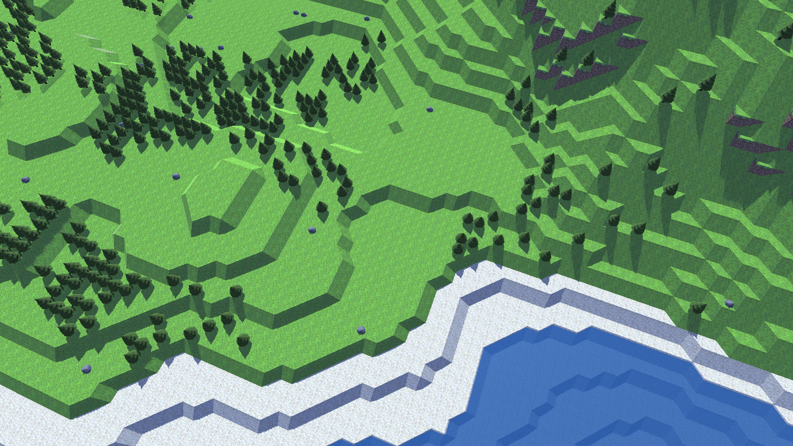
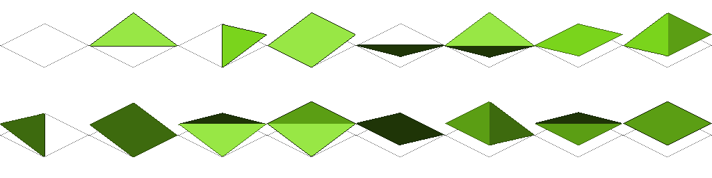
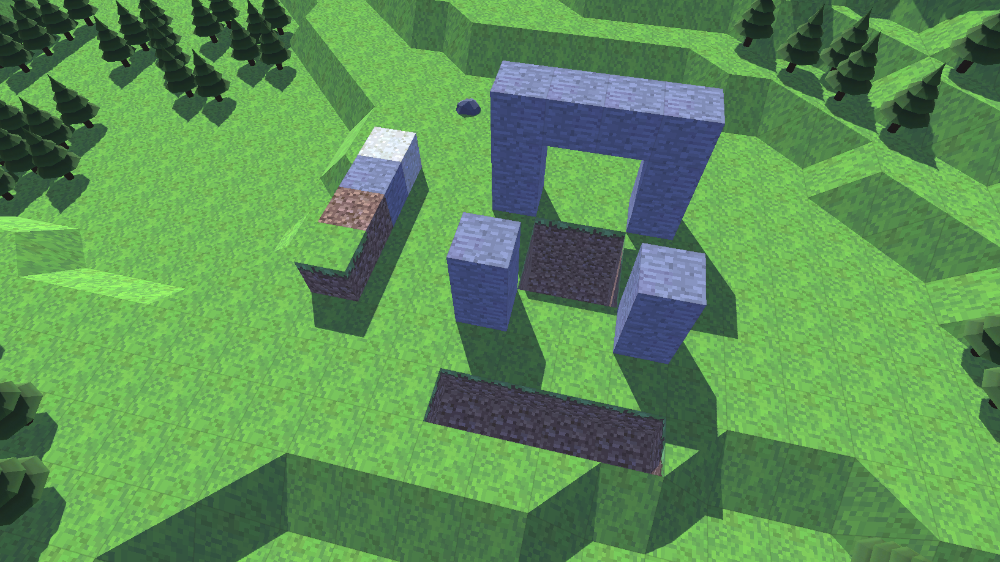

# Colony Management Project (In&nbsp;Progress)

## Concept
I wanted to make a 3D colony management game, inspired by Dwarf Fortress, where I could explore some of my own ideas and mechanics for the genre. Some of those ideas include fluid dynamics, procedural quests, and even multiplayer - however this is a bit ambitious. What I've managed so far, using Unity, is a procedurally generated world that's editable, saves/loads, and even supports actions such as pathfinding. I also took the opportunity to learn more about DOTS in Unity which greatly improved the performance of the world loading.

## World Generation

It starts with height map generation. I followed this [YouTube series](https://youtube.com/playlist?list=PLFt_AvWsXl0eBW2EiBtl_sxmDtSgZBxB3) to get the algorithm used for the height map, which is essentially layered Perlin noise with different frequencies and amplitudes. 

Turning this into a 3D interpretation was a bit harder. I wanted the world to be made of blocks and, to make things more managemeable, it was split into chunks of 16x16x64 blocks. For each chunk we loop through the blocks and sample the heightmap to see if (1) the block is visible, (2) what shape that block is in, and (3) what kind of block it is. Instead of using only cubes for blocks I opted for including slopes. This made things much more complicated because instead of just 1 possible shape, we now had 15-some possible shapes (see below) depending on which of the 4 corners of the block were raised or lowered.

Once the shapes of the blocks were determined the chunk's mesh still needed to be generated. This involves adding vertices, triangles, UVs, and normals which can be quite cumbersome, even more so working with 15 possible shapes. Instead of inefficiently calculating these at runtime, I created a table that mapped each shape to its corresponding set of mesh data - similar to how the [Marching Cubes](https://en.wikipedia.org/wiki/Marching_cubes) algorithm works.

With the mesh generation procedure implemented, it was just a matter of loading and unloading chunks as the player's camera came into view of it. If the chunk hasn't been seen before it generates the block data from the heightmap, otherwise once we've seen a chunk we can save its data to a file and reload it when we come across it again. This also let's us save any changes made to the world.

## Media

This video shows off the, technically infinite, world generation. Chunks load and unload as they come into and leave the camera's view.

	<video controls="true" allowfullscreen="true" width="100%" height="auto">
		<source src="images/cm_project/world.mp4" type="video/mp4">
	</video>

Below you can see how I've added and removed blocks of different types. The world can be edited in realtime and even saves so when you leave and come back your changes remain.

A video showing a pahtfinding test of a character. Using A* path finding, it looks for the shortest path trying to avoid going up or down slopes.

	<video controls="true" allowfullscreen="true" width="100%" height="auto">
		<source src="images/cm_project/pathfinding.webm" type="video/webm">
	</video>

