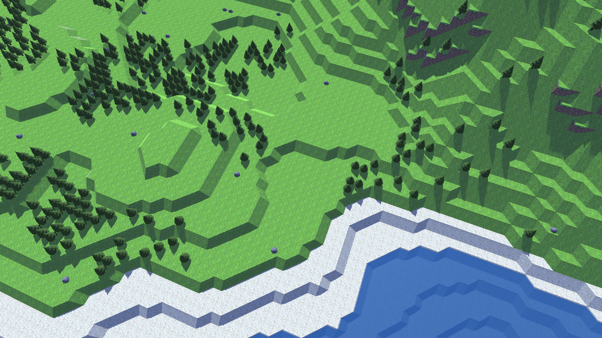
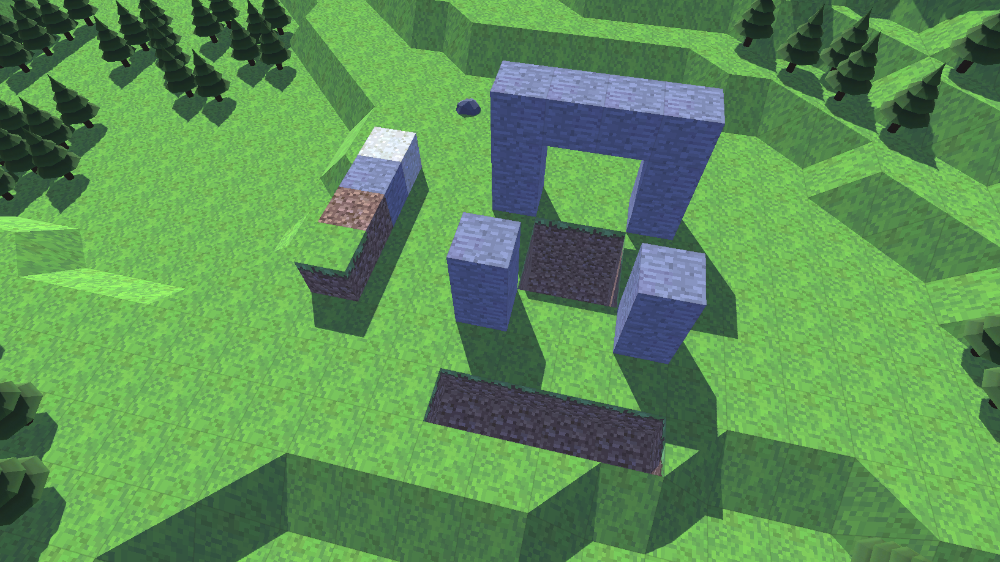

# "Dwarf Fortress" Project

## Concept
I wanted to make a 3D version of Dwarf Fortress where I could also explore some other gameplay mechanics. It was a great exercise in world generation and chunk management. I have ideas to add systems such as fluid simulation and other natural processes so the world is responsive and feels alive. Another cool idea is implemented multiplayer where you and a friend could each control your own colony on the same map, but it's a little ambitious.

## Media

This video shows off the, technically infinite, world generation. Chunks load and unload as they come into and leave the view.

	<video controls="true" allowfullscreen="true" width="100%" height="auto">
		<source src="images/df_game/world.mp4" type="video/mp4">
	</video>

Here's a picture of a location with generated foliage.

Below you can see how I've added and removed blocks of different types. The world can be edited in realtime and even saves so when you leave and come back your changes remain.

Lastly, here is a video showing a pahtfinding test of a character. Using A* path finding, it looks for the shortest path trying to avoid going up or down slopes.

	<video controls="true" allowfullscreen="true" width="100%" height="auto">
		<source src="images/df_game/pathfinding.webm" type="video/webm">
	</video>

