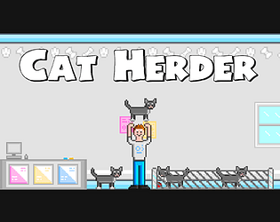
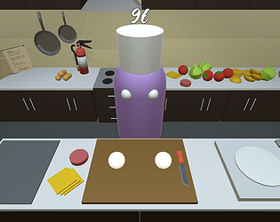
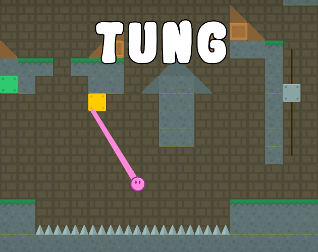

# Game Jam Games

Occasionally when I have the time I like to participate in online game jams, not only for fun but to also learn a thing or two about how I can improve my development workflow. So far I've only participated in game jams on my own.

## Cat Herder (2018)

### **[Play the Game Here](https://nickl.itch.io/cat-herder)**

__Cat Herder__ was made in 48 hours for _Ludum Dare #40_. The theme for this jam was "The more you have the worse it is". 

In this game you play as a pet shop owner who's trying to corral escaped kittens before the shop opens. The way it plays into the theme is each new day more cats are added thereby increasing the difficulty.

The cats, who are modeled after my own Felix, use a simple AI to move around and frustrate the player. Basically they randomly decide to move left, right, stay still, or jump. Because they can jump, it's possible for them to escape the corral after being captured. Once there's a dozen or so cats it becomes very hard to contain them all.

### What I Learned

I ended up dumping a lot of time into the sprites which I wanted to make myself because I enjoy pixel art (even if I'm not great at it). Because of this I had to cut some game elements that would have made it more interesting. These included a toy that could be thrown to attract cats and cardboard boxes that could be stacked to form a wall or opened to encourage cats to sit in them. While I had fun with the art, I wish I had prioritized the gameplay so I would've finished with something a little more fun to play.

## Quick & Easy (2019)

### **[Play the Game Here](https://nickl.itch.io/quick-and-easy)**

__Quick & Easy__ was made over the span of 1 week for _Weekly Game Jam #100_. The theme for this jam was "100".

It took a while for me to think of an idea for this jam, but I settled on a game where you had to prepare and cook a meal within 100 seconds. Using the admittedly wonky controls, you must pickup ingredients, chop, cook, and neatly plate it all before the timer runs out. At the end your dish is rated on several categories and is given a grade for quality.

I worked pretty heavily on this project over the week and was proud with how much I had done by the end of it. I was able to get a lot of mechanics coded including the player controls for moving, picking up, and holding items, chopping items with a knife, cooking items left on the grill (not too long or it'll catch on fire!), a working fire extinguisher, and the algorithm for grading your finished dish which considers ingredient doneness, arrangement, and completion.

### What I Learned
After receiving feedback on my game, and even a Youtube video, I realized there were several design choices I made that ended up confusing players and some elements I should have dedicated more time to.

Firstly the controls were a little too difficult and unintuitive. In a do-over I'd spend more time figuring out a better control scheme and having someone besides me test it out. It's also difficult to tell exactly where your hands are relative to the counter's surface. I think this could've been fixed by adding a shadow cast below the hands.

Secondly, some of the level assets were misleading, particularly the stove and pans you see in the background because they aren't actually usable. The gray slab in the foreground is a griddle you need to use to cook the patty and potato wedges, however I never considered telling the player this so of course it was confusing. 

Lastly, I did not leave enough time to test the dish grading algorithm and as a result it seems nearly impossible to get a grade above a C, which is dissapointing when you feel like you had done your best.

## Tung (2019)

### **[Play the Game Here](https://nickl.itch.io/tung)**

__Tung__ was made over the span of 1 week for _Weekly Game Jam #122_. The theme for this jam was "One action".

This game is a puzzle platformer where your character has no arms or legs and can only move  by grappling special blocks using its stretchy tongue, which is the single action the player can do. I had actually thought of this game idea before and this seemed like a good opportunity to make a prototype for it since the theme worked.

It's kind of a strange idea, but the concept of using your tongue to move around lent itself well to what the different block types could be. Sticking your tongue to a "normal" block allows you to swing at a fixed distance, a "tasty" block contracts your tongue and brings you closer to it, a "spicy" block is like a normal block but you can only hold on for a couple seconds before your tongue burns, and an "icey" block freezes your tongue and holds you at a fixed position. With certain combinations of these special blocks I was able to build some interesting levels.

### What I Learned
I didn't receive any feedback on this game, good or bad. There weren't very many participants, but I think that the bland thumbnail of the title screen (not shown here) and a rather annoying bug disuaded people from playing. I also did not get many levels created nor did I refine the main game mechanic which would have made the game more enjoyable.

All of these issues were caused by leaving too little time for things. The title screen was thrown together at the last minute and doesn't depict anything about the gameplay. Based on that screen alone it seems rather uninteresting. I also didn't test the game in the web browser which introduced an annoying bug that prevented the player from automatically respawning, however I didn't realize this until later.

The first four levels introduced the player to the game mechanics, which left the last four for elaborating on those concepts. It would have been great to have more levels but I simply didn't allocate the time for this.

Another nice thing I wanted to add was more realistic tongue physics. I had intended to make the tongue able to wrap around corners of the level geometry and be able to be slacked like a rope when it made sense to, but unfortunately I didn't have enough time to fully implement those features. As a result the moving blocks can cause some unexpected behavior and the player is more likely to get detached from a block in certain cases which feels unfair.

All in all though I think it's a good prototype and I'd like to return to this project in the future.