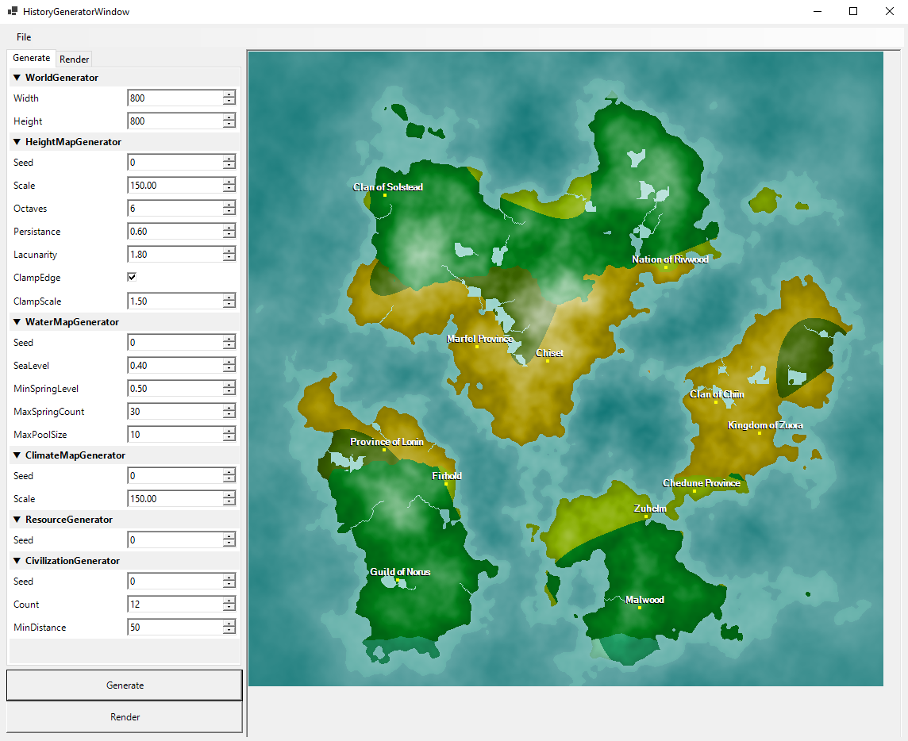
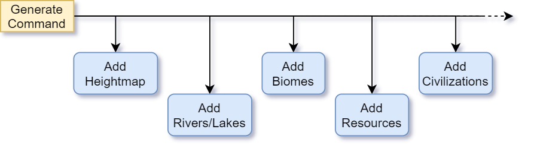
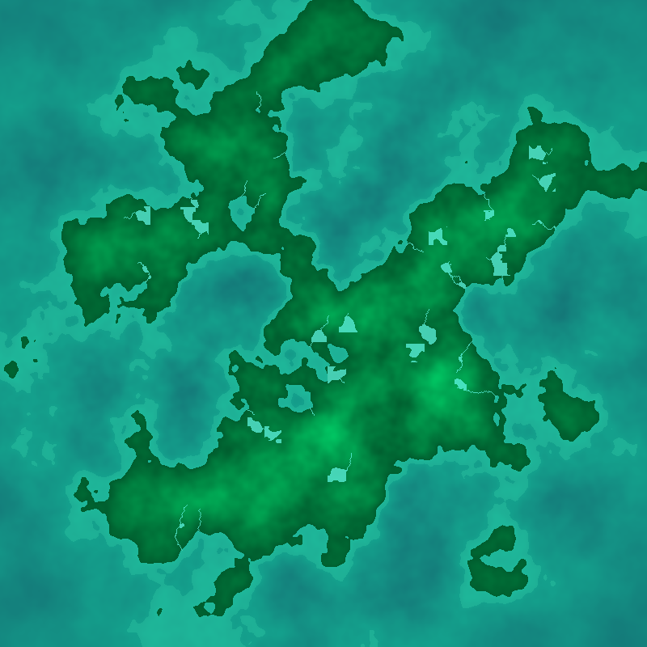
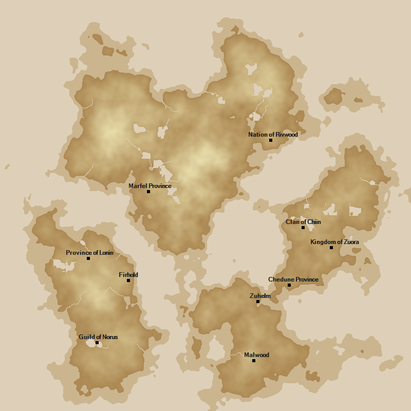

<link rel="stylesheet" type="text/css" media="all" href="styles.css" />

# History Generator (In Progress)



## Concept
The idea for this project is to create an application that the user can interact with to procedurarlly generate an entire world history. This would include generating a world map, simulating civilizations on a large scale, and creating lore via battles, relationships, artifacts, enemies, natural phenomena, etc.

World generation starts with creating a heightmap which defines the landmasses and oceans. Smaller bodies of water can then be added using the heightmap to create rivers that flow downhill and pool in vallies to form lakes. Next we can determine the climate which is a measure of warmth and wetness and results in several biomes such as deserts, grasslands, tropical forests, and tundras. Lastly, special resources are generated which can be either plant, animal, or mineral and will eventually be used by the civilizations we create.

Once the world is created, the civilizations can be added. Each will be unique having its own personality, government, and used resources. The personality or characteristics of a civilization will determine how it interacts with the environment and other civilizations as well as its own people.

With the world and civilizations generated the simulation can then take place. By looking at a cvilization's characteristics and the state of the world we can determine which actions its more likely to take. This would include things such as gathering resources, expanding, declaring war, or forming a union. Outside of a civilization's control, natural events could occur that may aid or hinder their motives.

The hope is that after doing all of this we should be able to log the progression of history based on the events that occur over time and spit out an interesting story of a unique world.

## Design
I decided to build this in .NET Core because it would be easier for me to design in and I wanted to learn how to program UI in a Windows-based application.

The app at its core is loosely based on the Chain-of-responsibility programming pattern. Basically, via the UI we can send a command to generate or render the world to a chain of processes that will perform some action, one-by-one in order, and when finished we can use the resulting world data to display a result.



This pattern enables us to easily add and remove processes with little to no coupling with other processes.

Below is the attribute class that I use to designate the process chain and dependencies for a process. Because it's an attribute I can define it on the process class itself and never have to "manually" enter it into the chain. The program simply looks up all classes using the attribute and builds the chains for us, and in the correct order.
```C#
public class ProcessAttribute : Attribute
{
    public string ProcessChain { get; set; }
    public Type[] Dependencies { get; set; }
}
```

```C#
[Process(
    ProcessChain = "Generate", 
    Dependencies = new[] { typeof(ClimateMapGenerator) }
)]
public class CivilizationGenerator : Process
{
    ...
```

Each process has an overrideable method `Execute(ProcessUnit)`. ProcessUnit contains the world data generated by previous processes in the form of a Dictionary and can be modified here. Therefore we can specify a dependency on our process, receive the result of that process in our new process, and generate new data based on it.

In addition to the Process attribute, there are also several settings attributes that can be defined on the process' properties. Doing so will automatically add them to the settings panel in the program window.

These process classes cannot only be used for generating the model but also rendering it. By adding another chain for rendering and adding a bitmap to the process unit at the start of the chain, I've made it so that each process on that chain can render a part of the data as a sort of layer in the final image. For example, the HeightMap*Generator* generates the heightmap model, then the HeightMap*Renderer* sets each pixel value in the bitmap according to the height at that world location. Each renderer also has a setting that controls how it blends with the previous layers.

Some alternative renderings created only by changing the render settings via the UI.

<div class="row">
  <div class="column">
    
  </div>
  <div class="column">
    
  </div>
</div>