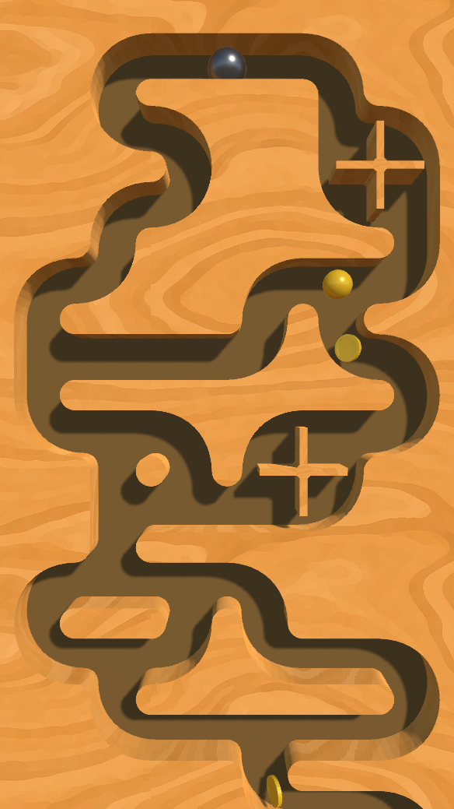
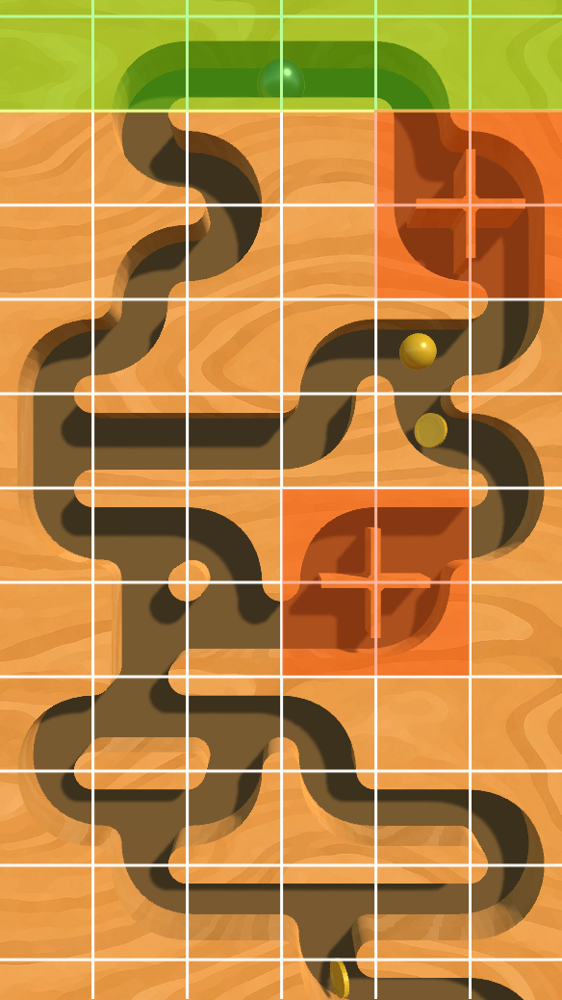
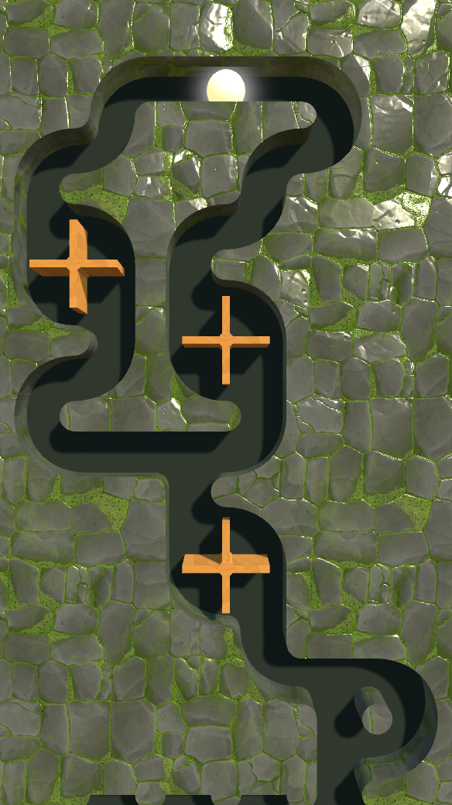
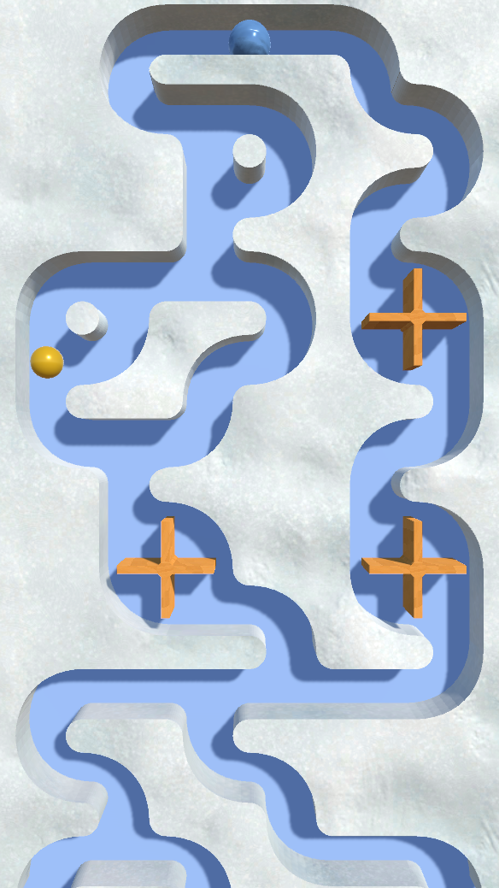

# Tilty Ball (In Progress)

Tilty Ball is an endless scrolling mobile game, made with Unity, where you guide a rolling ball through a procedurally generated level collecting coins which unlock new looks and powerups that may help you beat your high score.

### **[Play the Demo Here](../demos/tilty-ball)**

## Concept

Inspired by pinball and marble machines, I wanted to create an easy to play mobile game where the player tilts their device to move a ball through a series of paths and mechanisms ultimately seeing how far they can get. As the game goes on the level scrolling speeds up and it becomes harder to keep the ball below the top of the screen where it will cause a game over. The player will find coins and powerups along the way and may guide their ball to it and pick it up. Coins are used to unlock skins for both the level and the ball whereas powerups will grant special effects that can help the player stay in the game.

## Level Generation

The level generation method uses the concept of [2-edge Wang Tiles](http://www.cr31.co.uk/stagecast/wang/2edge.html). Square tiles fill a grid where each edge of a tile must match up with the edges of the tiles neighboring it. A reduced set of the tiles is used in this application so that the path will never lead upwards. To begin generation we need to seed the level with a random row, but in this case we can use a prefabricated tile group that includes the ball's spawn point and a path leading down. For every row after, we add random edge matching tiles starting where the previous row's path ended and continue until the row is filled. Lastly we loop through the tiles in the row and make sure at least one is leading downwards so we can continue the path on the next iteration.

The level also features groups of tiles or "tile chunks" where more interesting set pieces can be added to the path. These are inserted randomly into new rows as long as the perviously generated tiles can accomodate it. They span multiple rows, so the entire area is reserved in the grid so that new rows do not generate on top of it.

Coins and powerups are also randomly added to the level. Each tile and tile chunk includes spawn points where these items can spawn. As the level generates there is a random chance for one or the other to spawn at these points.

Below you can see an example of some generated rows (left) and an overlay (right) showing the grid and tile chunks in green/orange.

  

    
  

  

    
  

## Skins

The game was built with the intention of having different skins the player could purchase and swap out to add a bit of progression and customization. Skins are purchased with collected coins and enabled via the store page. For each tile skin I make prefab variants of every tile and tile chunk and add them to a custom ScriptableObject that keeps track of them in a list. A "tile factory" object then takes this in and uses it when initializing new pieces for the level generator. The ball can also have its look swapped out as well, although this is much simpler. 

Most level skin materials use a planar shader to hide the seams in between tiles and make the level appear as if it's carved from one smooth piece. A custom triplanar shader was created by modifying an existing one to support normal maps and other standard shader properties.

Below you can see examples of 2 different level skins and 2 different ball materials.

  

    
  

  

    
  

